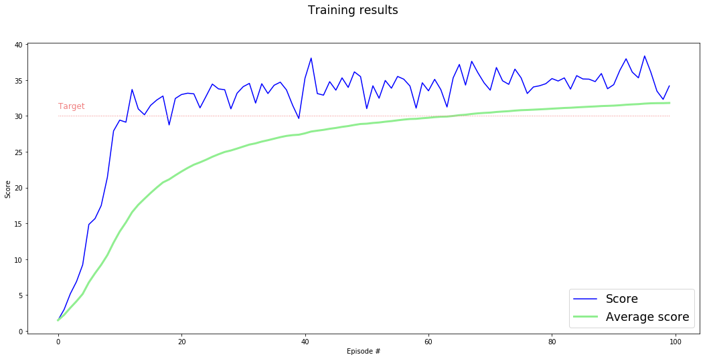

### Solution Walkthrough


#### The environment

In this environment, a double-jointed arm can move to target locations. A reward of **+0.1** is provided for each step that the agent's hand is in the goal location.  
Thus, the goal of the agent is to maintain its position at the target location for as many time steps as possible.


The observation space consists of **33 variables** corresponding to position, rotation, velocity, and angular velocities of the arm.  

Each action is **a vector with four numbers**, corresponding to torque applicable to two joints. Every entry in the action vector should be a number **between -1 and 1**.


#### Solving the environment

This implementation is solving Verson 2 of the environment with 20 agents.


#### Algorithm

The alorithm used in this implementaton is [Deep Deterministic Policy Gradient algorithm DDPG](https://arxiv.org/abs/1509.02971). DDPG is based on two neural networks Actor and Critic with the actor used to estimate the best action and the critict then used to evaluate the optimal action value function.

The Actor Network receives input of 33 variables representing the observation space and generates output of 4 numbers representing the predicted best action for that observed state. That means, the Actor is used to approximate the optimal policy _π_ deterministically.

The Critic Network receives input of 33 variables representing the observation space. The result of the first hidden layer and the action proceeding from the Actor Network are combined as input for the second hidden layer. The output of this network is the prediction of the target value based on the given state and the estimated best action. In other words the critic calculates the optimal action-value function _Q(s, a)_ based on the Actor best estimated action.

#### Network architecture

The fineal network architectures for Actor and Critic include.

_Actor_ 
* First fully connected layer with input size 33 and output size 128
* Second fully connected layer with input size 128 and output size 128
* Third fully connected layer with input size 128 and output size 4
* Cirtic has Batch Normalization layer between first and second layers with input size 128

_Critic_ 
* First fully connected layer with input size 33 and output size 128
* Second fully connected layer with input size (128 + 4) and output size 128
* Third fully connected layer with input size 128 and output size 1
* Batch Normalization layer between first and second layers

I started with 2 hidden layers sizes 400 and 300 for both actor and crtic as suggested in the DDPG paper and also tried [512, 384], [384, 256] and ended up with [128, 128] model that converged well with stable training peformance. I also tried using Batch Normalization for the actor network but it resulted in a worse traning performance.

#### Hyperparameters

In addition to network architectue describe in the previous section here are the final training hyperparaters:

* Max number of timestamps per episode: 1000
* Replay buffer size: 100000
* Batch size: 128
* Learning rate actor: 0.001
* Learning rate critic: 0.001
* Discounted reward factor: 0.99
* Sof Update interpolation: 0.001
* Noise decay: 0.999

### Training Results

##### Agent training logs

 ```
...
Episode  80 (02m51s)	Score: 34.49 	Average score: 30.95 
Episode  81 (02m51s)	Score: 35.20 	Average score: 31.00 
Episode  82 (02m52s)	Score: 34.86 	Average score: 31.05 
Episode  83 (02m52s)	Score: 35.30 	Average score: 31.10 
Episode  84 (02m52s)	Score: 33.73 	Average score: 31.13 
Episode  85 (02m51s)	Score: 35.61 	Average score: 31.18 
Episode  86 (02m49s)	Score: 35.15 	Average score: 31.23 
Episode  87 (02m47s)	Score: 35.12 	Average score: 31.28 
Episode  88 (02m47s)	Score: 34.78 	Average score: 31.32 
Episode  89 (02m47s)	Score: 35.91 	Average score: 31.37 
Episode  90 (02m48s)	Score: 33.78 	Average score: 31.39 
Episode  91 (02m49s)	Score: 34.35 	Average score: 31.43 
Episode  92 (02m49s)	Score: 36.37 	Average score: 31.48 
Episode  93 (02m49s)	Score: 37.96 	Average score: 31.55 
Episode  94 (02m48s)	Score: 36.11 	Average score: 31.60 
Episode  95 (02m49s)	Score: 35.30 	Average score: 31.64 
Episode  96 (02m48s)	Score: 38.36 	Average score: 31.71 
Episode  97 (02m49s)	Score: 36.11 	Average score: 31.75 
Episode  98 (02m47s)	Score: 33.45 	Average score: 31.77 
Episode  99 (02m46s)	Score: 32.30 	Average score: 31.78 
Episode 100 (02m48s)	Score: 34.18 	Average score: 31.80 

Environment solved in 0 episodes!	Average Score: 31.80	Elapsed time: 04h49m33s

 ```

##### Traning performance Graph



#### Agent testing log

```
Score for this episode: 33.47
```

#### Trained Model

* checkpoint.pt

### Ideas for Future Work

In this project I used DDPG with Experience Replay which solved the enviroment by getting +30 mean average reward relatively easily. Hear are some other approaches and future work ideas.

* I used Udacity workspace to solve the environment. I plan to setup local environment and watch trained agents in action.
* Explore Proximal [Policy Optimization Algorithm](https://arxiv.org/abs/1707.06347) that I studied in the course
* Implement [Prioritized Expereinece Replay](https://arxiv.org/abs/1511.05952)
 

